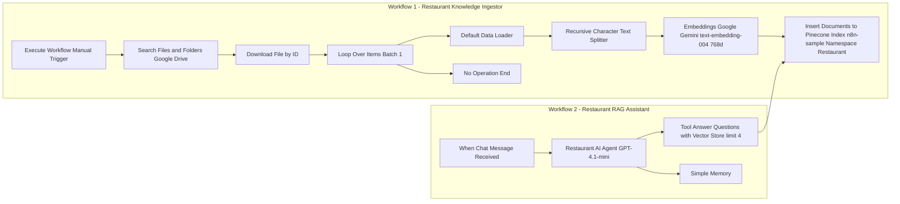

# 🍽️ **RAG AI Agent for Restaurant — Conversational Knowledge Assistant using n8n, Pinecone & Google Gemini**


---

## 📘 **Project Overview**

The **RAG AI Agent for Restaurant** is an end-to-end Retrieval-Augmented Generation (RAG) workflow built with **n8n**, **Pinecone**, and **Google Gemini embeddings** to create a **smart conversational assistant** for restaurant operations.
It ingests all restaurant documents — menus, reviews, reservations, promotions, events, and supplier info — into a vector database and enables **natural-language Q&A** through a chat agent powered by **GPT-4.1-mini**.
This ensures instant, accurate, and source-backed answers to operational and customer-related questions.

---

## 👥 **Who Benefits & Problems Solved**

### 🎯 **Primary Beneficiaries**

* **Restaurant Managers & Owners** – unified data access for faster decisions.
* **Front-Desk & Reservation Staff** – quick access to booking and policy info.
* **Kitchen & Inventory Teams** – easy look-up of supplier or stock details.
* **Marketing Teams** – check promotions, loyalty offers, and event rules.
* **Customer Support** – faster, accurate replies to guest feedback.

### 💡 **Problems Solved**

* Scattered restaurant data across files and drives.
* Time wasted manually searching for menu, schedule, or reservation info.
* Inconsistent answers from staff due to unclear policies.
* Delay in responding to feedback or event queries.

### 🚀 **Key Benefits**

* Single searchable knowledge base for all restaurant operations.
* Accurate, AI-powered answers with document citations.
* 70–80% faster query resolution time for staff.
* Privacy-first: PII automatically flagged and protected.
* Improved customer satisfaction & smoother workflows.

---

## 🧭 **Workflow Diagram**

**Visual Workflows:**

* %20Chat%20Model.JPG)
* %20Chat%20Model.JPG)
  
**Mermaid Overview:**



---

## ⚙️ **Node-by-Node Configuration**

### 🧩 **Workflow 1 — Data Ingestion**

#### **Step 1 — Execute Workflow (Trigger)**

**Purpose:** Start the workflow manually to ingest restaurant data.
**Action:** Initiates the pipeline when user clicks *Execute Workflow*.

---

#### **Step 2 — Search Files & Folders (Google Drive)**

**Purpose:** Locate restaurant documents (menu, reviews, policy, etc.).
**Parameters:**

* Credential: *Google Drive AIS*
* Operation: *Search (File/Folder Name)*
* Return All: ✅ True
* Search Query: `RAG AI AGENT (Multiple Files) Restaurant`

---

#### **Step 3 — Download File (Google Drive)**

**Purpose:** Download each located document for processing.
**Parameters:**

* Operation: *Download by ID*
* File ID: `{{ $json["id"] }}`

---

#### **Step 4 — Loop Over Items**

**Purpose:** Process files one by one.
**Parameters:**

* Batch Size: 1
* `done` → No Operation, `loop` → Insert to Pinecone

---

#### **Step 5 — Default Data Loader → Recursive Character Text Splitter**

**Purpose:** Convert binary data to text and split into chunks.
**Parameters:**

* Type: Binary | Mode: Load All Data | Splitting: Custom
* Chunk Size: 1000 chars | Overlap: 150

---

#### **Step 6 — Embeddings (Google Gemini)**

**Purpose:** Create embeddings using Google Gemini API.
**Parameters:**

* Model: `models/text-embedding-004`
* Output: 768-dim vectors → feed to Pinecone

---

#### **Step 7 — Insert Documents (Pinecone)**

**Purpose:** Store document embeddings into Pinecone Vector DB.
**Parameters:**

* Credential: *PineconeApi account*
* Index: `n8n-sample` | Namespace: `Restaurant`
* Operation: Insert Documents | Batch Size: 200
  **Note:** Use deterministic doc_id = hash(drive_id + modified_time) to avoid duplicates.

---

### 🧩 **Workflow 2 — Chat / Query Agent**

#### **Step 1 — When Chat Message Received (Trigger)**

**Purpose:** Start when a staff user sends a chat query.
**Parameters:**

* Input Expression: `{{ $json.chatInput }}`

---

#### **Step 2 — Restaurant AI Agent (GPT-4.1-mini)**

**Purpose:** Conversational agent that retrieves context and answers staff questions.
**Parameters:**

* Chat Model: GPT-4.1-mini
* Memory: Simple Memory
* Tools: *Answer Questions with Vector Store*

**🧠 System Message:**

```
You are a restaurant assistant. Your job is to answer questions from 
the staff about the menu, feedback, policies, hours of operation, 
and other internal information. All data is available in the vector store. 
Always call the vector store before answering to ensure accuracy. 
Be friendly, conversational, and occasionally add light humor or emojis 
to make interactions delightful for the staff.
```

---

#### **Step 3 — Answer Questions with Vector Store**

**Purpose:** Retrieve relevant context from Pinecone for each query.
**Parameters:**

* Limit: 4
* Operation Mode: Retrieve Documents (As Vector Store for Chain/Tool)
* Pinecone Index: `n8n-sample` | Namespace: `Restaurant`
* Model: GPT-4.1-mini (connected to tool)
* Rerank Results: Optional (enabled for precision)

---

#### **Step 4 — Pinecone Vector Store**

**Purpose:** Fetch relevant text chunks from the Restaurant namespace.
**Parameters:**

* Index: `n8n-sample`
* Namespace: `Restaurant`
* Embeddings: Google Gemini (768-dim)

---

#### **Step 5 — Simple Memory**

**Purpose:** Maintain short-term context during conversation.
**Usage:** Stores recent user Q&A for coherent multi-turn interactions.

---

## 💬 **Example Queries to Ask the RAG Agent**

1. What are today’s opening and closing hours?
2. Which dishes on the menu are vegan or gluten-free?
3. What’s our current Lunch Express promotion?
4. What’s the reservation deposit policy for special events?
5. Who are our preferred suppliers for fresh produce?
6. What’s the feedback trend from last week’s reviews?
7. What’s the order status for ORD-10027?
8. How does the loyalty program work?
9. What are upcoming events and seat limits?
10. Who should I contact for hotel information or GST details?

---

## 🔐 **PII & Security Practices**

* Automatic detection of phone numbers & emails during ingestion.
* `pii_flag=true` metadata for sensitive chunks (Suppliers, Orders, Reservations).
* Mask or redact PII in chat responses (e.g., `+91 XXXXX 23456`).
* Role-based access for internal vs public use.

---

## 🧩 **Free Workflow Templates**

📥 [Download Workflow 1 — Data Ingestion](https://github.com/SachinSavkare/RAG-AI-Agent-Restaurant-Use-Case-Chat-Model-n8n/blob/main/10.1%20RAG%20AI%20Agent%20_%20Ingest%20Data%20into%20Vector%20DB.json)
📥 [Download Workflow 2 — Chat Agent](https://github.com/SachinSavkare/RAG-AI-Agent-Restaurant-Use-Case-Chat-Model-n8n/blob/main/10.2%2010.%20RAG%20AI%20Agent%20(Multiple%20Files)%20_%20Chat%20Model.json)

---

## ✨ **How It Helps**

| Aspect              | Before                | After RAG Agent                          |
| ------------------- | --------------------- | ---------------------------------------- |
| Information Access  | Scattered across docs | One searchable knowledge base            |
| Response Speed      | Manual look-up        | Instant, AI-driven retrieval             |
| Accuracy            | Prone to human error  | Source-backed answers                    |
| Productivity        | Fragmented workflow   | Centralized automation                   |
| Customer Experience | Slow follow-ups       | Quick, consistent replies with emojis 😄 |

---

## ✍️ **Author**

**Sachin Savkare**
📧 `sachinsavkare08@gmail.com`

---
